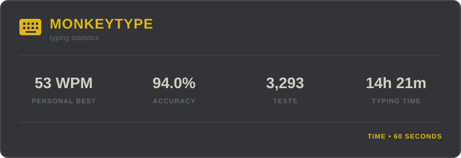

# 👋 Hey, I'm MOUAD!

I'm an aspiring **Front-End Developer** from Morocco 🇲🇦, currently focused on learning the core web technologies:

- 🔤 HTML  
- 🎨 CSS  
- 🧠 JavaScript  

## 🌱 My Learning Journey

I'm taking consistent steps daily to improve my skills and become job-ready as a **Junior Front-End Developer**.  
I’m building small, meaningful projects while sharing my progress daily.

## 🔧 What I'm Working On

- Creating clean, responsive layouts
- Building interactive elements with JavaScript
- Learning best practices with Git and GitHub
- Preparing to dive into **React** and **Tailwind CSS** soon!

## 💻 Projects You'll Find Here

- UI components and effects  
- Mini web apps  
- Creative animations and designs

---

# 💻 Tech Stack:
       
# 📊 GitHub Stats:

 
 

---

## ⌨️ Monkeytype Stats

  

---

## 📢 Let's Connect!

- 💼 [LinkedIn](https://www.linkedin.com/in/mouad-aiche-dev/)  
- 🌐 [Portfolio]() (coming soon)

Thanks for visiting my profile — feel free to explore my projects or say hello! 👋

---

> “Start where you are. Use what you have. Do what you can.”
